# School CRUD System - Frontend

This is the front-end repository for a school CRUD system developed as part of a full-stack developer challenge. The system allows CRUD operations on rooms/classes, students, and their siblings. The backend is developed with Express and Prisma and has features like CRUD operations, view details, admin section, login, and dashboard for non-authenticated users.


here you can create dynamically the claasses, name and capacity, create students and assign them to a class, assign them a sibling if exists. and visualize all the information seamlessly

## Main Features

- CRUD operations for rooms/classes, students, and siblings.
- View details of rooms/classes, students, and siblings.
- Admin section with login.
- Dashboard for non-authenticated users.
- Backend built with Express and Prisma.
- Linter for front-end and back-end.
- Good folder structure and page routing.
- React hooks used for app state.
- Tailwind CSS used for UI.

## Plus Features

- Filtered dropdowns and descriptive sibling cards with the delete button.
- Suggestions in search by name classrooms.
- Foreign key relations and field unique validations according to app logic in MySQL database.
- JWT authentication with session expiration by datetime and two Auth Roles - USER and ADMIN.
- Secure routing.
- Search by name in classes, and in the class detail page for students.
- Edit/Delete buttons when the auth session is valid.
- DB field for profile image URL (service not deployed).
- Full admin section and control of rooms/classes/students/details.
- Environment variables for backend API endpoints.
- Custom 404 error page.
- Modals for easy editing, creating, deleting.
## Installation and Usage

To run this project, clone the repository and run the following commands in the project directory:

```bash
yarn install
yarn dev
```

This will run the development server.

To build and start the server in production mode, run the following commands:

```bash
yarn build
yarn start
```

## Admin Login Credentials

- Email: bob@example.com
- Password: jqgdgVmVzjv

## Environment Variables

This project uses an environment variable `NEXT_PUBLIC_API_URL` to specify the URL for the backend API. To set this variable, create a file named `.env.local` in the root directory of the project and add the following line:

```bash
NEXT_PUBLIC_API_URL="apiurl"
```

Replace `"apiurl"` with the actual URL for your backend API. Make sure to restart the development server after adding or updating the `.env.local` file.


## Dependencies

### Production:

- Next.js
- React
- React-DOM
- @heroicons/react
- classnames
- react-modal
- usehooks-ts

### Development:

- Typescript
- eslint
- eslint-config-next
- postcss
- tailwindcss

## Links

- ExpressJS: https://expressjs.com/en/starter/hello-world.html
- Generate a random JWT secret: https://mojitocoder.medium.com/generate-a-random-jwt-secret-22a89e8be00d
- JSON Web Token: https://www.npmjs.com/package/jsonwebtoken
- Railway.app: https://railway.app/
- Custom Error Page in Next.js: https://nextjs.org/docs/advanced-features/custom-error-page
- Tailwind CSS: https://tailwindcss.com/docs
- Environment Variables in Next.js: https://nextjs.org/docs/api-reference/next.config.js/environment-variables

## User Interface

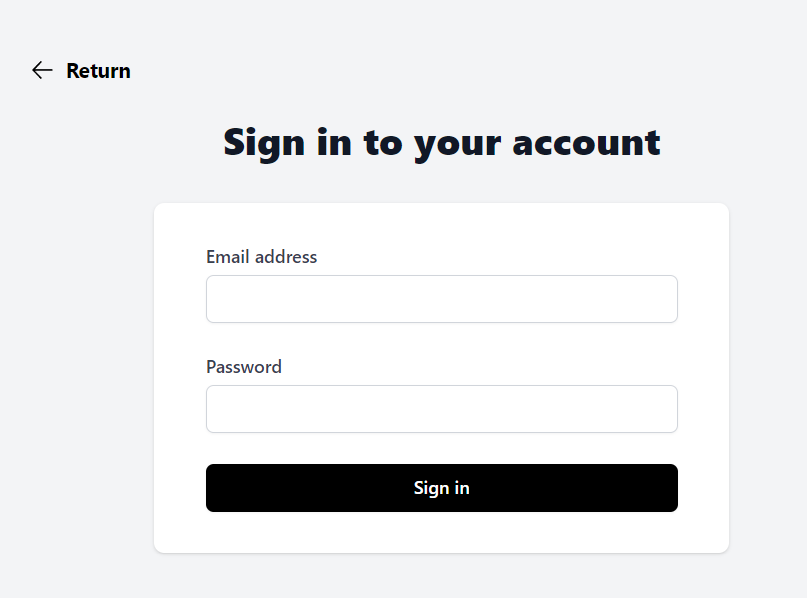

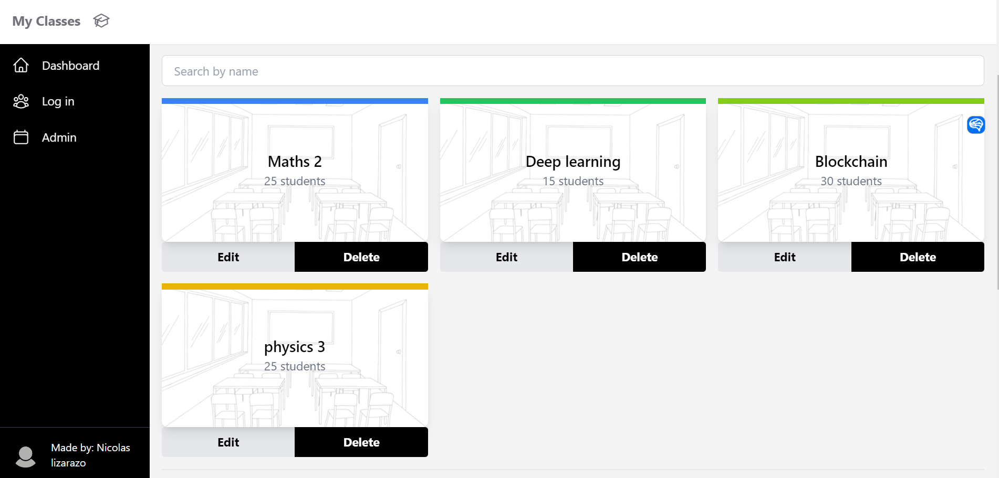

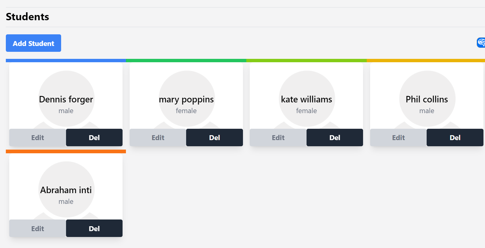

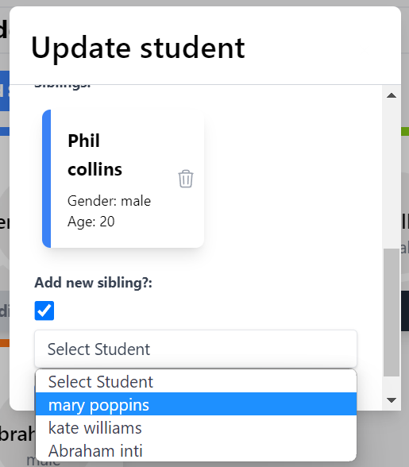

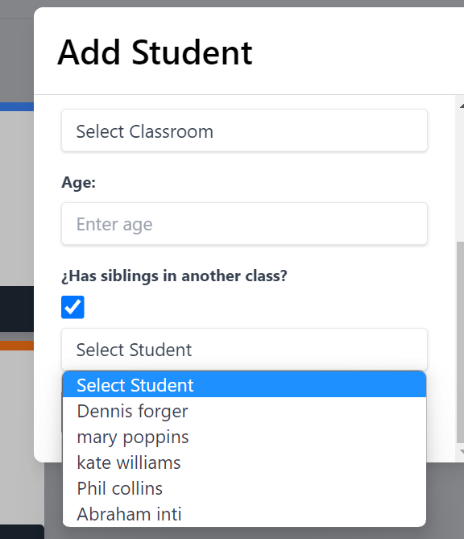

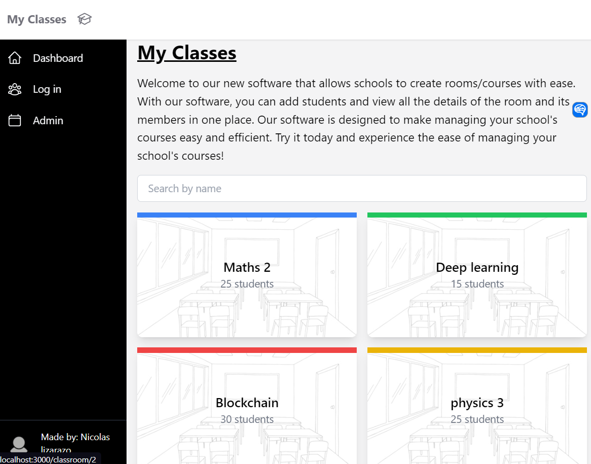

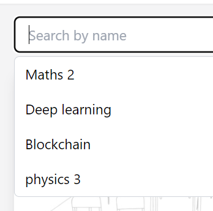

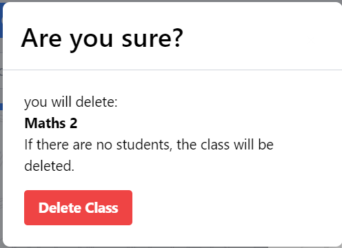

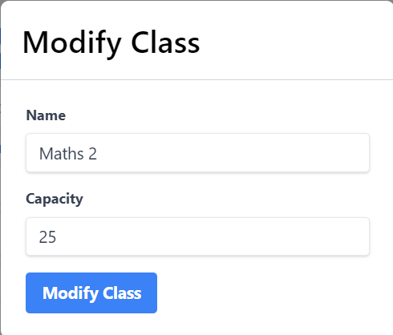

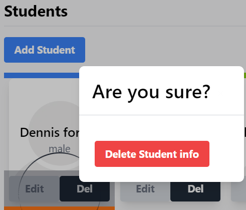

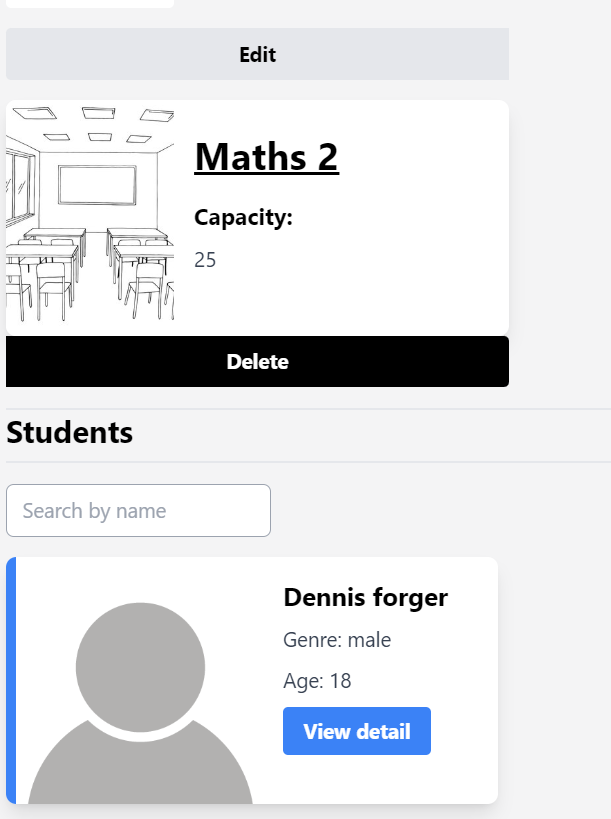

